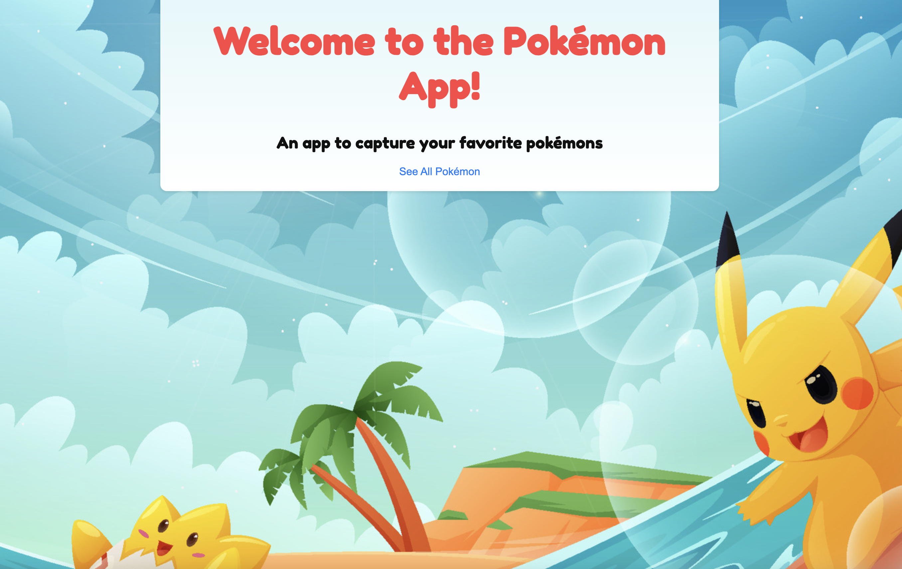

# Pokémon CRUD Adventure

Welcome to the Pokémon CRUD Adventure! This app lets you catch, view, edit, and release your favorite Pokémon, just like a true Pokémon Trainer. Built with Express.js, MongoDB, and a dash of Pokémon magic, this app is your Pokédex for managing both wild Pokémon (from the PokéAPI (wip)) and your own custom Pokémon (done).

Whether you're a seasoned Trainer or just starting your journey, this app is perfect for capturing the fun of Pokémon while learning CRUD operations. Ready to become the very best? Let’s get started!

## Features
- **Catch Wild Pokémon**: View Pokémon from the PokéAPI and add them to your collection.
- **Create Custom Pokémon**: Use a form to create your own unique Pokémon with custom names, types, and levels.
- **View Pokémon Details**: See detailed stats like type, level, and whether you've caught them.
- **Edit Your Pokémon**: Update your custom Pokémon's details whenever you want.
- **Release Pokémon**: Let your Pokémon go back to the wild with a simple click.
- **Pokémon-Themed Design**: Enjoy!

## Setup

To start your Pokémon adventure, follow these steps to set up the app on your local machine.

### Prerequisites
- **Node.js**: Make sure you have Node.js installed. [Download it here](https://nodejs.org/).
- **MongoDB**: You'll need MongoDB running locally or via a service like MongoDB Atlas. [Get MongoDB here](https://www.mongodb.com/try/download/community).

### Dependencies
This app is powered by the following technologies:

- Express.js: Web framework for Node.js.
- MongoDB & Mongoose: Database and ODM for managing custom Pokémon.
- EJS: Templating engine for rendering views.
- method-override: For handling PUT and DELETE requests.
